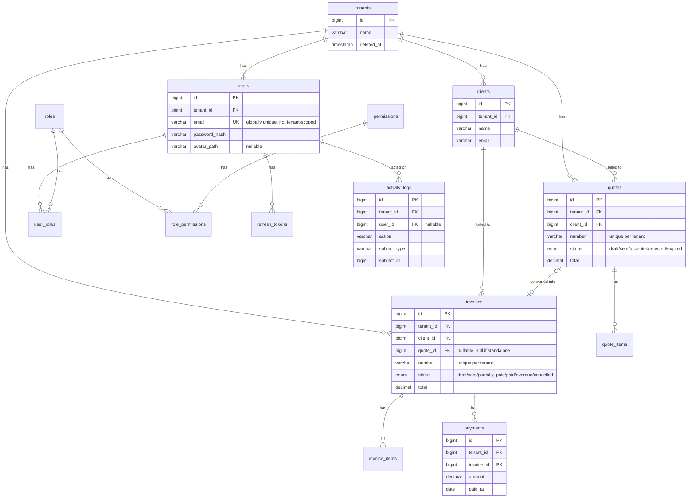

# Database schema

MySQL 8, native PDO (no ORM). 14 migrations, `backend/database/migrations/0001`-`0014`, run via
`php bin/migrate.php` (tracked in a `migrations` table, applied in filename order, never rolled
back automatically — `down()` exists per migration but there's no rollback CLI).

## Multi-tenancy

Shared database, shared schema: every business table carries a `tenant_id` column. A request's
tenant is resolved from the JWT's `tenant_id` claim by `TenantResolverMiddleware`, which verifies
it against the `tenants` table (rejects a deactivated/deleted tenant immediately, not just when
the token expires) and binds a `CurrentTenant` value object into the DI container.

The base `Core\Database\Repository` class type-hints `CurrentTenant` and calls
`QueryBuilder::forTenant()` on every query it builds — a subclass (`ClientRepository`,
`QuoteRepository`, ...) never gets an unscoped `QueryBuilder` to work with, so it structurally
cannot query across tenants. `forTenant()` also makes `insert()` auto-inject the tenant_id column,
overriding anything caller-supplied. This is proven by tests, not just claimed — see
`ClientRepositoryTest`, `QuoteServiceTest`, `InvoiceServiceTest`, `PaymentServiceTest`, and
`StatsServiceTest`, each asserting a second tenant gets a 404/empty result rather than another
tenant's data.

Three legitimate exceptions never extend the base `Repository` (documented in each class):
`TenantRepository` (resolves the tenant itself), `UserRepository` (looks a user up by email
*before* any tenant context exists, since login is email+password with no tenant-selection step),
and `RefreshTokenRepository` (same reason). `roles`/`permissions`/`role_permissions` carry no
`tenant_id` at all — they're a fixed, global RBAC matrix, not something a tenant customizes.

## Entity-relationship diagram



## Tables

### `tenants`
One row per customer organization. `name` only — no billing/plan fields (out of scope for this
project). Soft-deletable (`deleted_at`); `TenantResolverMiddleware` treats a soft-deleted tenant
as inactive and rejects every request for it.

### `users`
`email` is **globally unique, not tenant-scoped** — the one deliberate exception to the
tenant-scoped-uniqueness rule below, since login is email+password with no tenant-selection step.
`password_hash` via PHP's `password_hash()`/`PASSWORD_DEFAULT`. `avatar_path` (added in `0013`)
is nullable and stores a path *relative* to `public/uploads/avatars/`, not a full URL —
`AvatarService::urlFor()` builds the public URL on read, so the base URL can change without a
data migration.

### `roles`, `permissions`, `role_permissions`
Fixed, global RBAC matrix — four roles (`owner`, `admin`, `accountant`, `viewer`), seeded by
`RolesAndPermissionsSeeder` (`php bin/seed.php`, idempotent — upserts by slug, safe to re-run).
No `tenant_id`: every tenant shares the same role/permission *definitions*; only which role a
given user holds within a given tenant is tenant-scoped (see `user_roles` below).

### `user_roles`
The tenant-scoped join between a user and a role. Carries `tenant_id` directly — redundant with
`users.tenant_id`, but every tenant-scoped table gets this so it's filterable via
`QueryBuilder::forTenant()` without a join (the query builder doesn't support joins).

### `refresh_tokens`
Only the **SHA-256 hash** of the refresh token is stored, never the raw value — same principle as
a password hash, so a database leak doesn't hand out usable tokens. Rotated on every use
(`AuthService::refresh()`): the old token is revoked (`revoked_at` set, not deleted) and a new one
issued, limiting how long a stolen refresh token stays useful.

### `clients`
The simplest business table — `name`, `email`, `phone`, `address`, all except `name` nullable.
First table built on the base `Repository` class; the template every later business table follows
(tenant-scoped, soft-deletable, `(tenant_id, id)` composite index).

### `quotes` / `quote_items`
`status`: `draft → sent → accepted/rejected/expired` (enforced centrally by
`QuoteService::ALLOWED_TRANSITIONS`, not by the database). `number` (e.g. `QUO-2026-00001`) is
assigned **at creation**, including drafts, not only when first sent — trades a "burned" number
if an unsent draft is deleted for avoiding a nullable-then-unique column. `quote_items` has no
`deleted_at`: line items have no identity or audit value outside their parent quote, so editing
replaces the whole item set (delete-then-reinsert, `Core\Database\HasLineItems`) rather than
tracking per-item history.

### `invoices` / `invoice_items`
Same shape as quotes, plus `quote_id` (nullable — null for a standalone invoice, set when
converted from an accepted quote via `QuoteToInvoiceConverter`). `status`:
`draft → sent → partially_paid → paid`, plus `overdue` and `cancelled` as side branches
(`overdue → paid/cancelled` too — a late invoice can still be paid or written off). Added by `0011`:
`partially_paid` is reachable **only** through `PaymentService`, never a manual
`POST .../status` target — see Workflow below.

### `payments`
`invoice_id`, `amount`, `method` (free text, no enum — e.g. "bank transfer", "cash"), `paid_at`,
`notes`. No `deleted_at` column at the schema level was avoided in favor of the standard
soft-delete pattern (present, just unused by any current endpoint — no void/refund flow exists
yet). **No `paid_amount`/balance column on `invoices`** — the running balance is always computed
live via `SUM(payments.amount)` (`PaymentRepository::sumForInvoice()`), the same
"derive, don't denormalize" choice made throughout this schema rather than keeping a cached total
in sync.

### `activity_logs`
Added in `0014`. Append-only audit trail — **no `deleted_at` at all**, taking the
"accounting data is never destroyed" philosophy to its logical conclusion: an activity log entry
is never edited or removed, full stop. `subject_type` + `subject_id` identify what the entry is
about (e.g. `"Invoice"` + `42`) without a real foreign key (a log entry can outlive the row it
describes). `user_id` is nullable for a hypothetical future system-generated entry, though every
current entry has one. Populated as a side effect from the Controller layer (not the Service
layer) for quote/invoice status transitions, quote→invoice conversion, and payment recording —
deliberately not full CRUD on every entity, just the business-meaningful state transitions.

## Workflow

```
Client → Quote (draft → sent → accepted/rejected/expired)
              │
              │ convert (accepted only)
              ▼
         Invoice (draft → sent → partially_paid → paid)
                              │        │
                              ▼        ▼
                          overdue   cancelled
                              │
                    ┌─────────┴─────────┐
                    ▼                   ▼
                  paid              cancelled
```

A payment can only be recorded against a `sent`/`overdue`/`partially_paid` invoice (never
`draft`/`cancelled`/already-`paid`). `PaymentService::create()` computes the invoice's remaining
balance live and rejects any amount exceeding it — no overpayment/credit-note handling.

## Decisions applied throughout

- **Composite indexes `(tenant_id, id)`** on every business table — every list/lookup query is
  tenant-scoped first.
- **Soft deletes** (`deleted_at`) on business entities — never a hard `DELETE` of accounting data.
  (`activity_logs` is the one deliberate exception, for the opposite reason: it's meant to be
  even more permanent than a soft-deletable row.)
- **Tenant-scoped uniqueness**: `UNIQUE(tenant_id, number)` on quotes/invoices — the one exception
  being `users.email`, globally unique (see above).
- **No ORM, no migrations framework beyond a homemade one** — `Core\Database\Migration` is a
  two-method interface (`up()`/`down()`), `Migrator` just runs whatever hasn't run yet in filename
  order. Every migration is a single anonymous class returned from its file.
